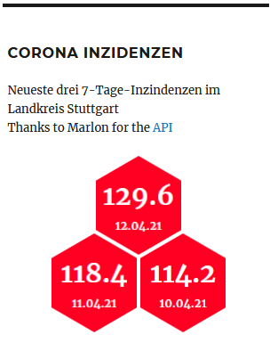
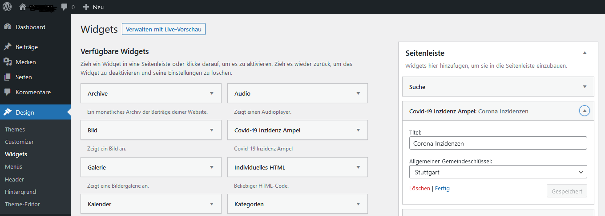

# Wordpress Widget: Covid-19 7-Tage-Inzidenz-Werte eines Landkreises

Dies ist mein erstes Wordpress Plugin. Es enthält ein Widget, das die drei neuesten 7-Tage-Inzidenzen für einen Landkreis als farbige Sechsecke anzeigt.

Die Farben sind abhängig vom Inzidenzwert

- grün: unter 50
- gelb: zwischen 50 und 100
- rot: über 100
- lila: über 200

Die Einstellungen im Wordpress Backend sind ganz einfach: einmal der Titel für das Widget und dann der gewünschte Landkreis (District):

## Hinter den Kulissen

Die Daten werden mit Hilfe der [RKI Covid API](https://github.com/marlon360/rki-covid-api) geholt. Es sollten idealerweise immer die Werte von heute, gestern und vorgestern angezeigt. Dies ist allerdings abhängig vom Zietpunkt der Abfrage und ob da schon die aktuellen Daten vorliegen.
Die Hexagons habe ich mit dem Tutorial von [CodeSmite](https://www.codesmite.com/article/how-to-create-pure-css-hexagonal-grids) erstellt

## Bekannte Probleme

- Werte werden nicht gecacht, obwohl sie sich nur einmal am Tag ändern
- unsichbare Hexagons links und rechts
- Schriftgröße bei Tablet Size

## Installation

1. im Wordpress Ordner unter `wp-content/plugins` einen Ordner namens `widget-7d-incidence` erstellen
2. dort den Inhalt des Github Ordners [`src`](src) einfügen, also die Datei `widget-7d-incidence.php`, den Unterordnert `css` und dessen Inhalt `style.css`
3. im Wordpress Backend unter installierte Plugins das Plugin aktivieren
4. unter **Design -> Widgets** das Widget zur Seitenleiste hinzufügen, Titel und Landkreis einstellen

   Bingo!
